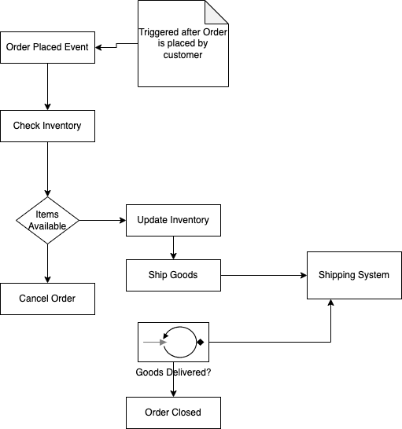
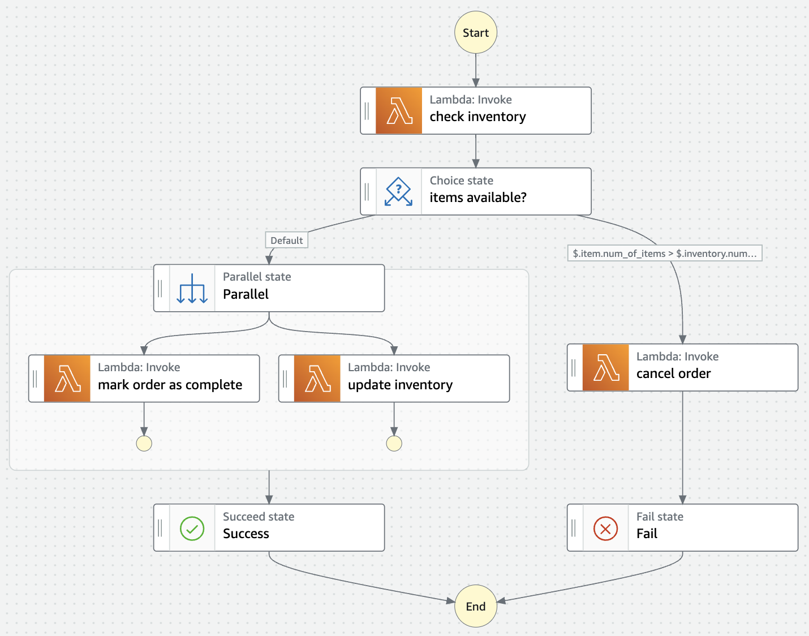
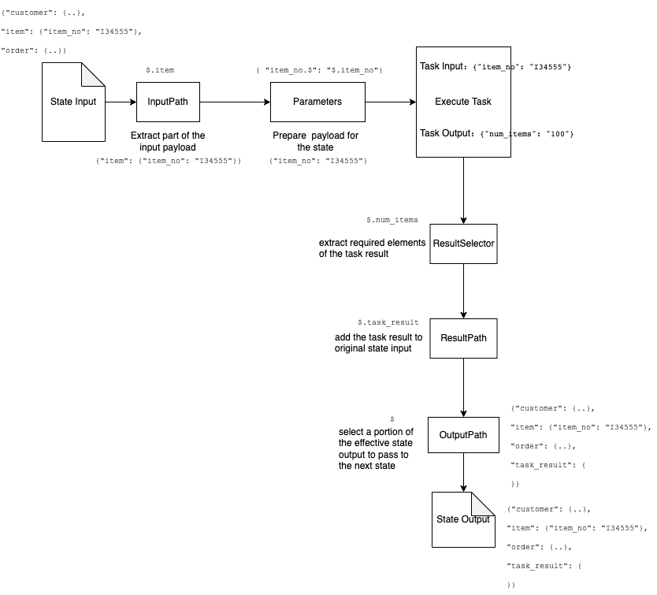
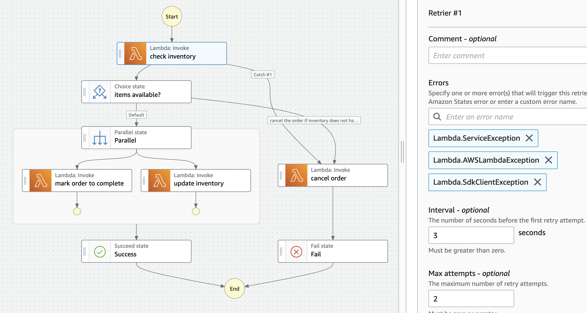

## Key Takeaways

* Coordinating between granular services is one of the common challenges when building complex applications.
* Traditionally orchestration was done in code (imperative style) or declaratively mostly using proprietary solutions.
* Step Functions is a serverless orchestration service in the AWS Cloud.
* We can build a wide variety of applications involving workflows like orchestrating microservices, automating both IT and business processes, and building data and machine learning pipelines.
* Step Functions is a low-code integration service with building blocks for actions, flows, and filters for input and output data.
* Step Functions workflows also provide blocks for configuring failure management with retries and fallback, parallelizing more than one action, integrating various AWS services, and setting up observability mechanisms.
* We define the workflows Step Function in JSON format using a schema called Amazon States Language (ASL).
* Step Functions also provide a visual interface: Workflow Studio to define, view, debug, and run workflows.

In this article, we will understand the main concepts of AWS Step Functions and apply those to build a workflow for a sample business process: `Order Fulfillment`.

## AWS Step Function Implement a State Machine

AWS Step functions use a State Machine to represent the workflow. A workflow consists of a set of tasks, each of which represents a discrete activity to be performed. Each task is defined by a state of the state machine. 

Fundamentally, a state machine is an abstract mathematical concept of representing the possible states of a system at a particular points in time. It has traditionally been used to model state transitions in Unified Modeling Language (UML) in the field of software engineering.

We define the state machine of a Step Function in JSON format using a schema called Amazon States Language (ASL). A state machine for a sample loan approval workflow will look like this in the Workflow Studio:


We can create two types of state machines: `Standard` and `Express`. The `Express` type is used for high-volume, event-processing workloads and can run for up to five minutes. The `Standard` type is the default and is used to create workflows for long-running, durable, and auditable processes. 

## A State Machine has States

Each step of a workflow is represented by a state in the state machine and connected to one or more states through transitions. A state takes an input, performs some action depending on the type of the state, and emits an output to be passed on to the next state.

States of type `Task` perform the units of "work" in a state machine. They are configured as an API call to one of the AWS services. The parameters to the API are either specified in the definition of the state machine or supplied at runtime.

The "work" is performed by using an `activity` or by calling the API actions of AWS services. AWS Lambda function is the most common service used by `Task` type states by calling the `invoke` method of the Lambda service. 

An `activity` is a program hosted on another system like EC2, ECS, or mobile devices. Unlike Lambda functions activities poll Step Functions while waiting for the `Task` type state to execute. 

Apart from the `Task` type state, some other types of state are:
1. `Choice`: Decision point with one or more branches with child states one of which executes based on a boolean condition
2. `Map`: Iterate multiple times over a child state
3. `Parallel`: Execute one or more branches in parallel
4. `Success` or `Fail`: End the execution with success or failure
5. `Pass`: A placeholder where we can perform data transformations and use for debugging executions

We will come across these types of states in the example of the order fulfillment process in subsequent sections.

## Defining the State Machine for Order Fulfillment Process
Let us first define the state machine for the order fulfillment process. 

We can define a state machine from the Workflow Studio in the AWS Management Console or by defining the states in Amazon States Language (ASL) in the Step Functions console or by uploading a file containing the state definition in ASL. 

Let us use Workflow Studio to author our state machine for this example. We will also select the type of state machine as `standard` because our order fulfillment process is long-running and can run for more than `5` minutes. 

We will give the name: `order fulfillment` to our state machine and assign an IAM role that defines which resources our state machine has permission to access during execution. Our IAM policy definition is associated with the following policy:

```json
{
    "Version": "2012-10-17",
    "Statement": [
        {
            "Effect": "Allow",
            "Action": [
                "lambda:InvokeFunction"
            ],
            "Resource": [
                "*"
            ]
        }
    ]
}
```
This policy will allow the state machine to invoke any Lambda function. 

A typical order fulfillment process uses a workflow similar to this:


This workflow is triggered after an order is placed by the customer and consists of the steps shown in the diagram. A Step Functions state machine to represent this workflow will look like this in the Workflow Studio:



As we can see, we have used the following states to define this state machine:

1. `Check Inventory`: This is a state of type: `Task` and invokes a Lambda function `check inventory`
2. `Cancel Order`: This is a state of type: `Task` and invokes a Lambda function `update order`
3. `Mark Order as complete`: This is a state of type: `Task` and invokes a Lambda function `update order`
4. `Update Inventory`: This is a state of type: `Task` and invokes a Lambda function `update inventory`
5. `items available`: This is a state of type: `Choice` with 2 branches. If items are not available the order is canceled
6. `Parallel`: This is a state of type: `Parallel` with 2 branches which the state machine executes in parallel
7. `Success`: End the execution with a success
8. `Fail`: End the execution with a failure

We can also see a start and end indicator to define the start and end positions for the execution of the state machine.

The corresponding definition of the state machine in the Amazon States Language (ASL) looks like this:

```json
{
  "Comment": "order processing",
  "StartAt": "check inventory",
  "States": {
    "check inventory": {
      "Type": "Task",
      "Resource": "arn:aws:states:::lambda:invoke",
      "OutputPath": "$.Payload",
      "Parameters": {
        "FunctionName": "arn:aws:lambda:us-east-1:**********:function:checkInventory:$LATEST"
      },
      "Next": "items available?"
    },
    "items available?": {
      "Type": "Choice",
      "Choices": [
        {
          "Variable": "$.item.num_of_items",
          "NumericGreaterThanPath": "$.inventory.num_of_items",
          "Next": "cancel order"
        }
      ],
      "Default": "Parallel"
    },
    "Parallel": {
      "Type": "Parallel",
      "Branches": [
        {
          "StartAt": "mark order as complete",
          "States": {
            "mark order as complete": {
              "Type": "Task",
              "Resource": "arn:aws:states:::lambda:invoke",
              "OutputPath": "$.Payload",
              "Parameters": {
                "Payload.$": "$",
                "FunctionName": "arn:aws:lambda:us-east-1:**********:function:updateOrder:$LATEST"
              },
              "End": true
            }
          }
        },
        {
          "StartAt": "update inventory",
          "States": {
            "update inventory": {
              "Type": "Task",
              "Resource": "arn:aws:states:::lambda:invoke",
              "OutputPath": "$.Payload",
              "Parameters": {
                "Payload.$": "$",
                "FunctionName": "arn:aws:lambda:us-east-1:**********:function:updateInventory:$LATEST"
              },
              "End": true
            }
          }
        }
      ],
      "Next": "Success"
    },
    "Success": {
      "Type": "Succeed"
    },
    "cancel order": {
      "Type": "Task",
      "Resource": "arn:aws:states:::lambda:invoke",
      "OutputPath": "$.Payload",
      "Parameters": {
        "Payload.$": "$",
        "FunctionName": "arn:aws:lambda:us-east-1:**********:function:updateOrder:$LATEST"
      },
      "Next": "Fail"
    },
    "Fail": {
      "Type": "Fail"
    }
  }
}
```
Our state machine definition in ASL contains a collection of `state` objects. It has the following mandatory fields:
* `States`: This field contains a set of `state` objects. Each element of the set is a key-value pair with the name of the state as `key` and an associated `state` object as the value. 
* `StartAt`: This field contains the name of one of the state objects in the `States` collection from where the state machine will start execution.

This structure has the `States` field containing the collection of all the state objects with names like: `check inventory`, `cancel order`, `update inventory`, etc. The value of the field: `StartAt` is `check inventory` which means that the state machine starts execution from the state named `check inventory`.

Each state object has a `Type` attribute for the type of the state and a `Next` attribute. The `Next` attribute contains the name of the next state that the state machine will execute. 

Other attributes of the state object are dependent on the type of the state. In this example, for each of the states of type `Task`, we have defined an attribute `Resource` with a value of `arn:aws:states:::lambda:invoke` to represent the API to be called. 

We have defined the parameters of the API in an attribute `Parameters` which takes a set of key-value pairs. 

We can see the keys: `FunctionName` and `Payload.$`. The `FunctionName` key has a value of the name of the Lambda function while the key `Payload.$` contains an expression to determine the input to be passed to the Lambda function during the execution of the state machine. 

We will understand the passing and manipulation of the input and output by the various states during the execution of the state machine in the next section.

## Data Manipulation with Input and Output Filters
We can invoke state machines asynchronously or synchronously depending on whether the type of workflow is `standard` or `express`. 

Step Functions receive input in JSON format which is then passed to the different states in the state machine. We can configure different kinds of filters to manipulate data in each state both before and after the task processing as shown in this diagram:


Let us understand how we can use these filters by applying them to the different states of the state machine of our order fulfillment process. Let us suppose that our order processing workflow takes the following input:

```json
{
    "order_processing_request": {
        "customer": {

        },
        "item": {
                "item_no": "I1234",
                "num_of_items": 5,
                "shipping_date": "23/12/2022",
                "shipping_address": "address_1"
        },
        "order_details" : {
                "order_id": "ORD345567",
                "order_date": "15/12/2022"
        }    
    }
}
```
The input data consists of information about the customer who has placed the order, the item for which the order is placed, and the order details. This input is fed to the first state: `check inventory`. The state machine will execute the lambda function: `check inventory` associated with this task.

Here is the code for the Lambda function for `check inventory`:

```js
exports.handler = async (event, context, callback) => {
    const item_no = event.item_no
    const num_of_items = event.num_of_items
    console.log(`item::: ${item_no} ${num_of_items}`)
    
     // TODO fetch inventory info from the database
    const inventoryData = getInventoryDataForItem(item_no)
   
    callback(null, inventoryData)
}

function getInventoryDataForItem(item_no) {  
    var rand = Math.random()*100
    var power = Math.pow(10, 0)
    quantity_in_stock =  Math.floor(rand*power)
    
    const inventory = {
                        sku: "S0001",  
                        quantity_in_stock: quantity_in_stock, 
                        warehouse_no: "W001", 
                        age_of_stock_in_days: 98 
                      }
    return inventory
}
```
It takes the `item_no` as input and fetches the inventory information from a data store. For this example, we are returning a hardcoded value of the inventory data.

We will prepare the input for the Lambda function using two filters:
1. `InputPath`
We have set this filter as `$.item`
This filter will extract the `item` attribute from the input of the state machine. Here is the result of applying this filter:

```json
{
    "item_no": "I1234",
    "num_of_items": 5,
    "shipping_date": "23/12/2022",
    "shipping_address": "address_1"
}
```
2. `Parameter`: This filter will prepare the input required by the Lambda function.
```json
{
  "item_no.$": "$.item_no",
  "num_of_items.$": "$.num_of_items"
}

```

Here is the result of applying the filters `InputPath` and `Parameter` to the state input:

```json
{
    "item_no": "I1234",
    "num_of_items": 5
}
```

This is the input payload that will be used by the state machine to execute the task associated with this state.
The result of the execution of the Lambda function: `checkInventory` is:
```json
{
  "sku": "S0001",
  "quantity_in_stock": 84,
  "warehouse_no": "W001",
  "age_of_stock_in_days": 98
}
```
When the Lambda function is invoked by the `Task` type state of the state machine it will look like this:
```json
{
  "ExecutedVersion": "$LATEST",
  "Payload": {
      "sku": "S0001",
      "quantity_in_stock": 84,
      "warehouse_no": "W001",
      "age_of_stock_in_days": 98
  },
  "SdkHttpMetadata": {
    "AllHttpHeaders": {
      ...
    },
    "HttpHeaders": {
      ...
    },
    "HttpStatusCode": 200
  },
  "SdkResponseMetadata": {
    "RequestId": "ac79dacd-7c6f-41c7-bfcf-eea70b43e141"
  },
  "StatusCode": 200
}
```
If we do not apply any more filters, this payload will be passed on to the next state. In that case, we will lose the original input data containing `customer` and `order` information which will be required to execute the remaining states of the state machine. We also do not need all the fields returned in the JSON response.

For preserving the original input and extract only the relevant fields from the task result for further processing by the state machine, let us add some more filters:

1. `ResultSelector`: We use this filter to construct a new JSON payload containing only the fields required for executing the remaining states in the state machine. For example, we can safely discard the fields: `warehouse_no` and `age_of_stock_in_days` which are not required for any other processing. Accordingly, we will define the `ResultSelector` filter with the following expression:
```json
{
    "num_items_in_inventory.$": "$.Payload.quantity_in_stock",
    "item_sku.$": "$.Payload.sku"
}
```
This will construct a payload with only the attributes `num_items_in_inventory` and `item_sku`. Our payload after applying this filter to the execution result of the task looks like this:
```json
{
  "num_items_in_inventory": 84,
  "item_sku": "S0001"
}
```

2. `ResultPath`: We use the ResultPath filter to add the task result to the original state input.
We have defined the ResultPath filter for the current state: `check inventory` as `$.task_result`. Our payload after applying this filter will be:

```json
{
    "order_processing_request": {
        "customer": {
           "customer_id": "C123456"
        },
        "item": {
                "item_no": "I1234",
                "num_of_items": 5,
                "shipping_date": "23/12/2022",
                "shipping_address": "address_1"
        },
        "order_details" : {
                "order_id": "ORD345567",
                "order_date": "15/12/2022"
        }    
    },
    "task_result": {
        "num_items_in_inventory": 84,
        "item_sku": "S0001"
    }
}
```
We can now see the output of the `ResultSelector` appended to the input data under the attribute `task_result`.

3. `OutputPath`: The OutputPath filter is used to extract a portion of the output to pass to the next state. For example, we will define OutputPath filter as `$.order_processing_request.order_details` if we need only `order_details`. For our example of order fulfillment, we need all the fields so we will define `$` as the value of the OutputPath filter which is also the default.

The state `check inventory` after adding these filters looks like this:

```json
{
  "Comment": "order processing",
  "StartAt": "check inventory",
  "States": {
    "check inventory": {
      "Type": "Task",
      "Resource": "arn:aws:states:::lambda:invoke",
      "OutputPath": "$",
      "Parameters": {
        "FunctionName": "arn:aws:lambda:us-east-1:926501103602:function:checkInventory:$LATEST",
        "Payload": {
          "item_no.$": "$.item_no",
          "num_of_items.$": "$.num_of_items"
        }
      },
      "Next": "items available?",
      "InputPath": "$.order_processing_request.item",
      "ResultSelector": {
        "num_items_in_inventory.$": "$.Payload.quantity_in_stock",
        "item_sku.$": "$.Payload.sku"
      },
      "ResultPath": "$.task_result"
    },
```

## Handling Errors in Step Function Workflows
In absence of any error handling, the execution of a state machine will fail whenever a state reports an error. States of type: `Task` provides options for configuring a retry and fallback for handling errors.

### Retrying on Error
We configure retry by defining one or more retry rules, called `retriers`. This will allow the task to be retried for execution when errors occur during the execution of the task.

{}
Coming to our example, our Lambda function can encounter errors of type: `Lambda.ServiceException`, `Lambda.AWSLambdaException`, or `Lambda.SdkClientException`.
To retry the task for `check inventory`, when these errors occur, we have defined a `retrier`:

```json
{
  "Comment": "order processing",
  "StartAt": "check inventory",
  "States": {
    "check inventory": {
      "Type": "Task",
      "Resource": "arn:aws:states:::lambda:invoke",
      "OutputPath": "$",
      "Parameters": {
        "FunctionName": "arn:aws:lambda:us-east-1:926501103602:function:checkInventory:$LATEST",
        "Payload": {
          "item_no.$": "$.item_no",
          "num_of_items.$": "$.num_of_items"
        }
      },
      "Retry": [
        {
          "ErrorEquals": [
            "Lambda.ServiceException",
            "Lambda.AWSLambdaException",
            "Lambda.SdkClientException"
          ],
          "IntervalSeconds": 3,
          "MaxAttempts": 2,
          "BackoffRate": 2
        }
      ],
      "Next": "items available?",
    }
```
Here we have defined the `retrier` with an `Interval` of `3` seconds, `MaxAttempts`: `2`, and a `BackoffRate` of 2. The Interval is the number of seconds before the first retry attempt. `MaxAttempts` is the maximum number of retry attempts and `BackoffRate` is the multiplier by which the retry interval increases with each attempt.

### FallBack to a Different State on Error
We can revert to a fallback state when errors occur by defining rules for intercepting the errors, called "catchers".
In this example, we are defining a `prepare error` state to which the `check inventory` state can fall back if it encounters an error of type: `States.TaskFailed`.

The state machine with a `retrier` and a `catcher` defined for the `check inventory` step looks like this in the Workflow Studio:


We have defined the `check inventory` to fallback to the `cancel order` state on encountering an error or type `State.TaskFailed`.

## Conclusion
In this article, we looked at the main concepts of AWS Step Function and used those to define a workflow for an Order Fulfillment process. Here are the main points from the article for quick reference:
1. We created a state machine of type `standard` since the order fulfillment is a long-running process.
2. We used an IAM role to give permission to the state machine to call different AWS Lambda functions.
3. We used states of type: `Task`, `Parallel`, `Choice` `Success`, and `Fail` in the state machine.
4. We defined the filters `InputPath`, `Parameter`, `ResultSelector`, `ResultPath`, and `Outputpath` to manipulate the data through the state machine during execution.
5. We attached error handling to a state by configuring a retry and a fallback condition.


